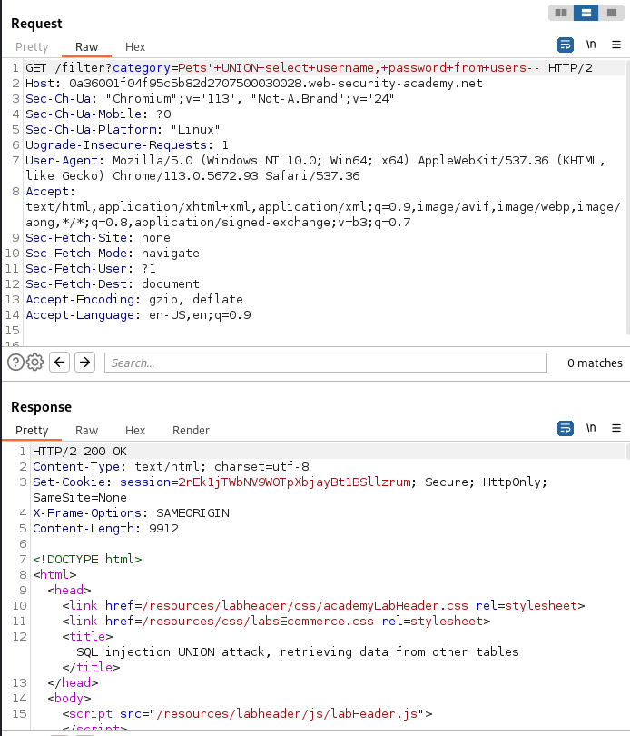

# Using SQLi UNION attack to retrieve interesting data
- After the determination of the number of columns and found the data type of each column, we can now retrieve interesting data from the database.
- Suppose 
    - The original query returns two columns both of holds string data type
    - The injection point is within `WHERE` clause
    - The database contains a table named `users` with columns `username` and `password`.

# Lab:
- **Vulnerability** in product category filter.
- **Result** are returned in the application's response, so can use `UNION` attack to retrieve data from other tables.
- **Goal**: Retrieve the username and password of all users.

## Given:
- **Database** contains table called `users` with columns `username` and `password`.
- **LOGIN info**:
    - Username: `administrator`

## To Solve:
- Retrieve the `username` and `password` of all users.

## Steps:
1. Determine the number of columns required to perform the attack using the previous null steps.
2. Find the data type of each column.
3. Use the `UNION` attack to retrieve the `username` and `password` of all users. Can be tested using burp like in image.


4. **SQLi Payload**:
    - `?category=any' UNION SELECT username, password FROM users--`
5. Using the above payload and modifying the **URL** as in the image.


6. The **step 5** provide number of username and password where you have to find the administrator scrolling down or may be in the first
7. Copy the password and move to my account section and paste the password along with username `administrator` and login.
Example:
    ```
    administrator
    3z6sa2y4fbbbpruqf68j
    ```
    Here the `password` = `3z6sa2y4fbbbpruqf68j`
8. Lab will be solved after **step 7**.
