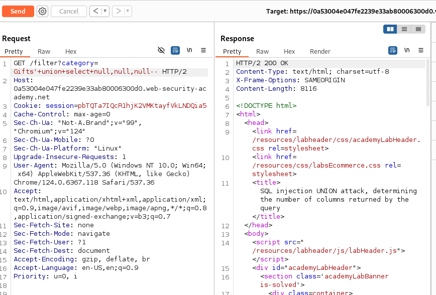

# SQL injection UNION attack
- When an application is vulnerable to an SQL injection, and the result of the query are returned within the application's responses, attacker use the `UNION` keyword to retrieve data from other tables in the database
```sql
SELECT a, b FROM table1 UNION SELECT c, d FROM table2
```
- The SQL query returns a single result set with two columns, `a` and `b`, from `table1` and `c` and `d` from `table2`

- For `UNION` query to work, two key requirements must be met:
  1. The number of columns in the two `SELECT` statements must be the same
  2. The data types in each column must be compatible between the two `SELECT` statements

- To carry out an SQL injection `UNION` attack, make sure these two requirements.
    - How mny columns are being returned by the original query
    - Which columns returned from the original query are of a suitable data type to hold the results from the injected query

## Determining the number of columns required
- Two effective ways
  - One involves injecting series of `order by` clauses and incrementing the column until the error occurs
  - Second method is using `UNION SELECT` payloads specifying different number of null values.
  ```sql
  UNION SELECT null--
  UNION SELECT null,null--
  UNION SELECT null,null,null--
  ```
  - If number of nulls does not match the number of columns, the database returns error
  - `NULL` is convertible to every common data type, so it maximizes the chance that the payload will succeed when the column count is correct. 

### Rules can be obtained from microsoft by searching sql union operator

# Lab: SQL injection UNION attack, determining the number of columns returned by the query

### SQL injection: product category filter

### To solve: Determine number of columns returned by the query

## Analysis:
- The query is vulnerable to an SQL injection attack which was detected by adding `'` at last
- proxy was enabled and was send to the `burp`
- The code was right clicked and forwarded to `repeater` where we add `'+union+null--` for the first time and was repeated by adding `null,null--` until we get `200 OK` response as shown in the figure below:


- This solved the lab and we get to know there was three columns returned by the query

### For manual written code follow to this link
[](union_attack.py)